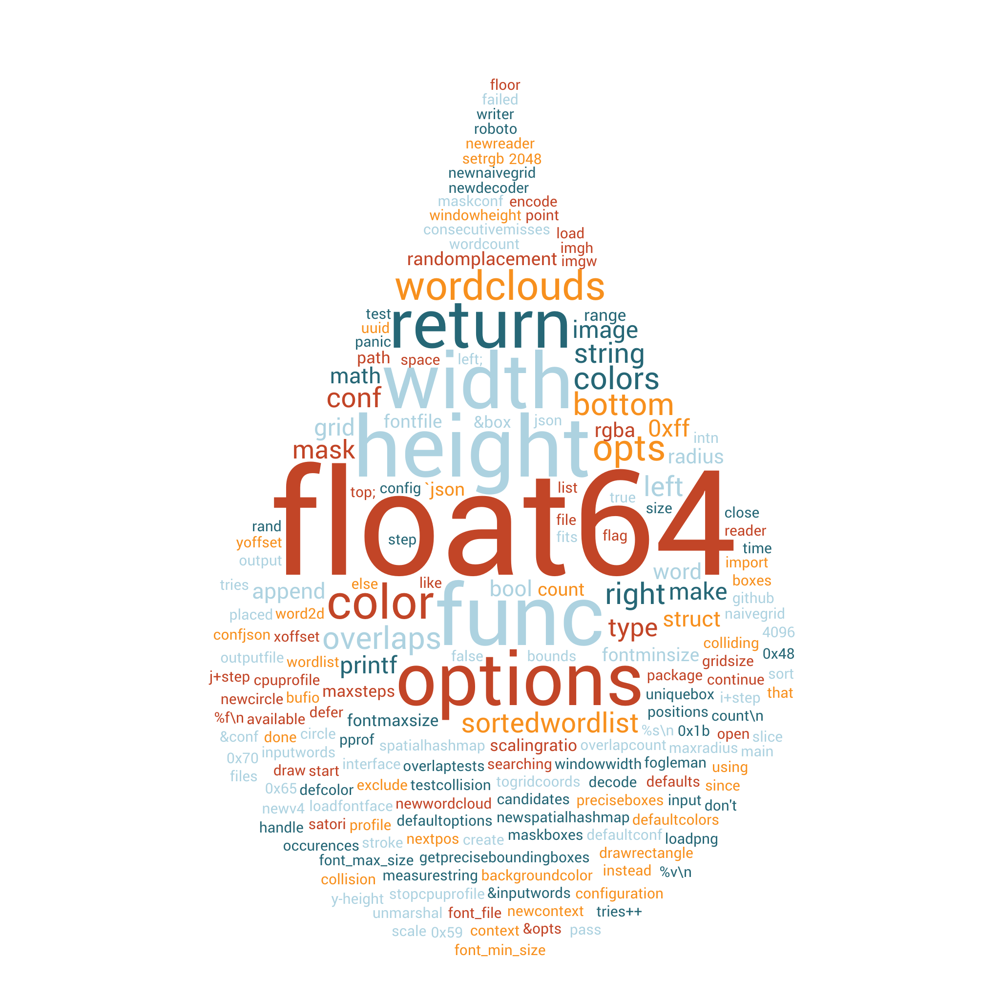

Wordclouds in go.



# How to use

```go
wordCounts := map[string]int{"important":42, "noteworthy":30, "meh":3}

w := wordclouds.NewWordcloud(
	wordCounts,
	wordclouds.FontFile("fonts/myfont.ttf"),
	wordclouds.Height(2048),
	wordclouds.Width(2048),
)

img := w.Draw()
```

# Options

- Output height and width
- Font: Must be a valid TTF files.
- Font max,min size
- Colors
- Background color
- Placement : random or circular
- Masking

# Masking

A list of bounding boxes where the algorithm can not place words can be provided.

The `Mask` function can be used to create such a mask given a file and a masking color.

```go
boxes = wordclouds.Mask(
	conf.Mask.File,
	conf.Width,
	conf.Height,
	conf.Mask.Color,
)
```

See the example folder for a fully working implementation.

# Speed

Most wordclouds should take a few seconds to be generated. A spatial hashmap is used to find potential collisions.

There are two possible placement algorithm choices:
1. Random: the algorithms randomly tries to place the word anywhere in the image space.
   - If it can't find a spot after 500000 tries, it gives up and moves on to the next word.
2. Spiral: the algorithm starts to place the words on concentric circles starting at the center of the image.

# Contributing

Feel free to create pull requests, I'll gladly review them!
